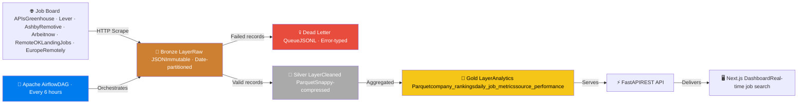
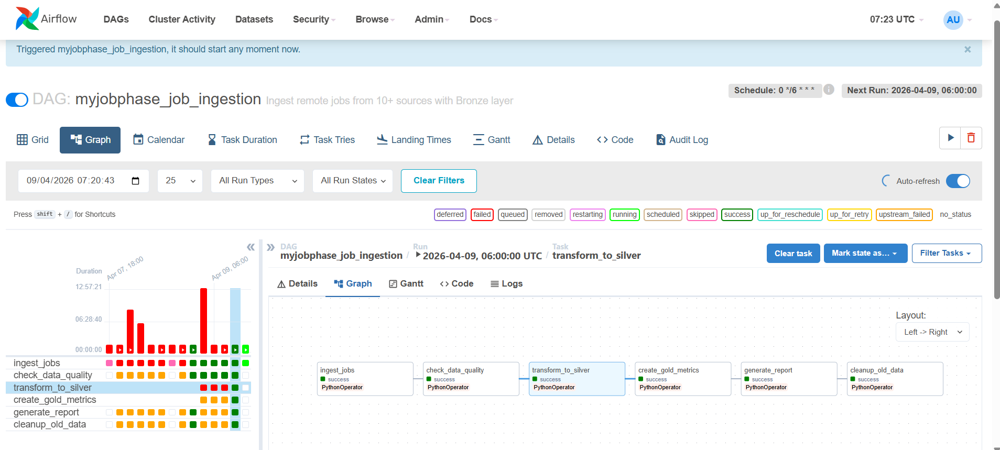

# MyJobPhase — Data Engineering Pipeline

> A production-grade data pipeline that ingests, validates, transforms, and 
> aggregates 1,900+ worldwide remote job listings daily from 11 sources using 
> a Bronze/Silver/Gold lakehouse architecture orchestrated by Apache Airflow.

---

## Architecture



---

## Pipeline Statistics

| Metric | Value |
|--------|-------|
| **Data Sources** | 11 job boards |
| **Silver Records** | 1,982 (latest run) |
| **Gold Tables** | 3 aggregated tables |
| **DLQ Filtered** | 34 US-only records isolated |
| **Pipeline Schedule** | Every 6 hours via Airflow |
| **Storage Format** | Parquet (Snappy compression) |
| **Orchestration** | Apache Airflow 2.7.3 |
| **Last Updated** | April 9, 2026 |

---

## Airflow DAG

The pipeline runs as a 6-task DAG with automatic retry logic and 
data quality gates between each stage.



### Task Chain
ingest_jobs → check_data_quality → transform_to_silver → create_gold_metrics → generate_report → cleanup_old_data

| Task | Description |
|------|-------------|
| `ingest_jobs` | Triggers FastAPI ingestion endpoint — scrapes all 11 sources concurrently |
| `check_data_quality` | Reads DLQ, counts filtered records, raises alert if >1,000 failures |
| `transform_to_silver` | Reads Bronze JSON → cleans → deduplicates → saves Parquet per source |
| `create_gold_metrics` | Loads all Silver → computes 3 aggregated Gold tables |
| `generate_report` | Counts total Bronze records, logs source breakdown |
| `cleanup_old_data` | Deletes Bronze files older than 30 days |

---

## Data Layers

### 🔶 Bronze — Raw Immutable Storage

Every API response is saved verbatim before any processing. This enables:
- **Disaster recovery** — rebuild the entire database from Bronze if needed
- **Replay** — reprocess historical data with updated transformation logic
- **Audit trail** — know exactly what each API returned and when
data/bronze/
├── greenhouse_stripe/
│   └── 2026-04-09/
│       └── 14-30-22.json        # Raw API response + metadata
├── ashby_openai/
│   └── 2026-04-09/
│       └── 14-31-05.json
└── ... (11 sources)

Each Bronze file contains:
```json
{
  "source": "greenhouse_stripe",
  "ingested_at": "2026-04-09T14:30:22",
  "record_count": 493,
  "metadata": { "org": "stripe", "source_type": "Greenhouse" },
  "data": [ ... ]
}
```

### 💀 Dead Letter Queue — Data Quality Isolation

Records that fail validation (US-only locations, missing fields) are 
isolated to the DLQ instead of being silently dropped. This enables:
- Analysis of what was filtered and why
- Trend tracking — is filtering rate increasing?
- Future reprocessing if filter logic changes
data/dlq/
└── filter/
└── 2026-04-07/
└── greenhouse_stripe.jsonl   # One JSON per line

Each DLQ record:
```json
{
  "timestamp": "2026-04-07T05:39:28",
  "source": "greenhouse_stripe",
  "error": "US-only location: Remote in US",
  "error_type": "filter",
  "record": { "title": "...", "company": "stripe", "location": "..." }
}
```

### 🥈 Silver — Cleaned Parquet

Bronze data is cleaned and standardized into Parquet files partitioned by date.

Transformations applied:
- Column names standardized to `snake_case`
- Null values filled with sensible defaults
- Dates parsed and converted to UTC microseconds
- Text fields stripped of whitespace
- Duplicates removed on `(title, company, url)`
- `silver_processed_at` timestamp added for lineage
data/silver/
├── greenhouse_stripe/
│   └── 2026-04-09.parquet    # 464 records · 889 KB
├── ashby_openai/
│   └── 2026-04-09.parquet    # 593 records · 1.2 MB
└── ... (11 sources)

**Why Parquet over CSV/JSON:**
- Columnar format — read only the columns you need
- Snappy compression — ~70% smaller than equivalent JSON
- Schema-enforced — column types stored in file metadata
- Industry standard for data lakes (S3 + Parquet = standard stack)

### 🥇 Gold — Aggregated Analytics

Silver data is aggregated into 3 business-level tables, recomputed each run.

#### `company_rankings.parquet`
Top 50 companies by worldwide remote job postings:

| company | total_jobs | rank |
|---------|-----------|------|
| openai | 593 | 1 |
| welocalize | 473 | 2 |
| stripe | 464 | 3 |
| elastic | 169 | 4 |
| notion | 152 | 5 |

#### `daily_job_metrics.parquet`
Daily aggregations for trend analysis:

| date | total_jobs | unique_companies | sources_active |
|------|-----------|-----------------|----------------|
| 2026-04-07 | 11 | 3 | 3 |
| 2026-04-06 | 25 | 6 | 6 |

#### `source_performance.parquet`
Contribution per scraper — used to detect broken sources:

| source | total_jobs | pct_of_total |
|--------|-----------|-------------|
| ashby_openai | 593 | 29.9% |
| lever_welocalize | 473 | 23.9% |
| greenhouse_stripe | 464 | 23.4% |

---

## Tech Stack

| Layer | Technology |
|-------|-----------|
| **Orchestration** | Apache Airflow 2.7.3 |
| **Ingestion** | Python · httpx · asyncio |
| **Storage** | Local filesystem (Bronze/Silver/Gold) |
| **Transformation** | Pandas · PyArrow |
| **File Format** | Parquet (Snappy compression) |
| **API** | FastAPI · Python 3.11 |
| **Database** | PostgreSQL · Supabase |
| **Frontend** | Next.js 14 · TypeScript |
| **Containerization** | Docker · Docker Compose |

---

## Data Quality Framework

### Validation at every stage
API Response
↓
Bronze (save everything raw)
↓
Filter Check (is_worldwide_remote?)
├── Pass → Silver transformation
└── Fail → DLQ (isolated, not deleted)
↓
check_data_quality task
(alerts if >1,000 failures)

### DLQ Error Types

| Error Type | Description |
|-----------|-------------|
| `filter` | US-only location detected |
| `validation` | Missing required fields |
| `parsing` | Malformed API response |

---

## Running Locally

### Prerequisites
- Docker Desktop
- Git

### One-command setup

```bash
git clone https://github.com/yourusername/myjobphase
cd myjobphase
docker-compose up -d
```

### Access services

| Service | URL | Credentials |
|---------|-----|-------------|
| Airflow UI | http://localhost:8080 | admin / admin |
| FastAPI | http://localhost:8000 | — |
| API Docs | http://localhost:8000/docs | — |

### Trigger pipeline manually

```bash
# Via Airflow UI — click ▶ on myjobphase_job_ingestion
# Or via API:
curl -X POST http://localhost:8000/internal/trigger-ingest
```

### Inspect Gold tables

```python
import pandas as pd

# Company rankings
df = pd.read_parquet('backend/data/gold/company_rankings.parquet')
print(df.head(10))

# Source performance
df = pd.read_parquet('backend/data/gold/source_performance.parquet')
print(df)
```

---

## Repository Structure
jobboard/
├── backend/
│   ├── app/
│   │   ├── ingest/              # 11 source scrapers
│   │   │   ├── storage.py       # Bronze layer + DLQ
│   │   │   ├── greenhouse.py
│   │   │   ├── lever.py
│   │   │   └── ...
│   │   ├── transform/
│   │   │   ├── silver.py        # Cleaning + Parquet
│   │   │   └── gold.py          # Aggregations
│   │   ├── orchestrator.py      # Pipeline coordinator
│   │   └── main.py              # FastAPI app
│   ├── dags/
│   │   └── myjobphase_ingestion_dag.py   # Airflow DAG
│   ├── data/                    # Generated (gitignored)
│   │   ├── bronze/
│   │   ├── silver/
│   │   ├── gold/
│   │   └── dlq/
│   └── Dockerfile.airflow
├── frontend/                    # Next.js dashboard
└── docker-compose.yml

---

## Key Engineering Decisions

**Why Bronze before database?**
If PostgreSQL corrupts or transformation logic has a bug, Bronze files 
allow full pipeline replay without re-scraping APIs (which may rate-limit).

**Why Parquet over CSV?**
At 1,900+ records per run × 4 runs/day × 365 days, columnar compression 
matters. Parquet with Snappy is ~70% smaller and 10x faster for 
column-selective queries.

**Why DLQ instead of silent drops?**
Silent drops hide data quality degradation. The DLQ makes filtering 
visible and auditable — a spike in DLQ records signals a scraper problem.

**Why Airflow over APScheduler?**
APScheduler (already in the app) handles recurring jobs fine. Airflow adds 
DAG visualization, task-level retry logic, execution history, and the 
portfolio signal that you understand production orchestration tools.

---

*Built by Hezekiah Enahoro O.(https://github.com/hezekiahenahoro) · 
[MyJobPhase](https://myjobphase.com) · April 2026*